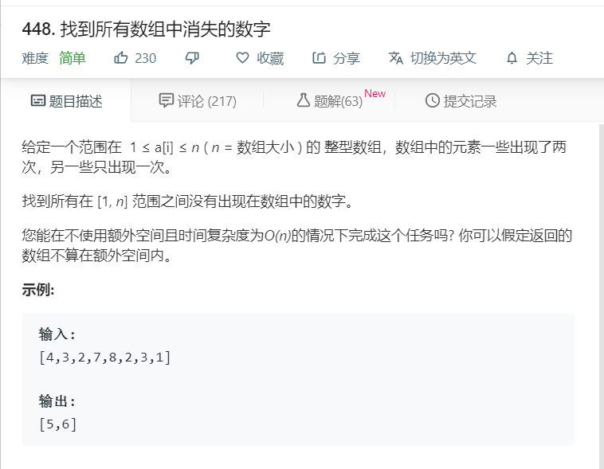

# 448.找到所有数组中消失的数字
  

```
/**
 * @param {number[]} nums
 * @return {number[]}
 */
var findDisappearedNumbers = function(nums) {
    let temp = [];
    nums.sort((a,b)=>a-b);
    // console.log(nums);
    for(let i=1;i<=nums.length;i++){
      if(nums.indexOf(i)<0){
        temp.push(i);
      }
    }
    // console.log(temp);
    return temp;
};
```