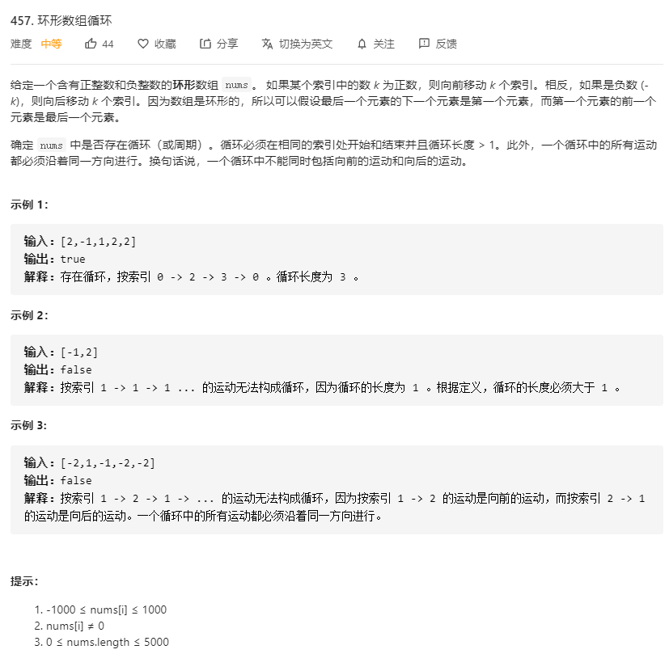

# 457.环形数组循环
  

### 超时
```
/**
 * @param {number[]} nums
 * @return {boolean}
 */
var circularArrayLoop = function(nums) {
    let res = false;
    let only = new Set();
    const mid = (temp, arr, direction) => {
        // console.log(temp, arr, direction)
        if(arr.length > 1 && arr.indexOf(temp) > -1 && temp !== arr[arr.length-1]) {
            res = true;
            return ;
        } 

        if (only.has(temp)) {
            return ;
        } else {
            only.add(temp);
        }

        for(let i=temp;i<nums.length;i++) {
            const one = (temp != 0 && arr.length != 0);
            // console.log("i >>>", i, arr, temp, one);
            if (direction.length > 0 && direction[direction.length - 1] < 0 && nums[i] > 0) {
                return ;
            }
            if (direction.length > 0 && direction[direction.length - 1] > 0 && nums[i] < 0) {
                return ;
            }

            if(arr.length === 0 || arr.indexOf(i) < 0) {
                arr.push(i);
                direction.push(nums[i]);
                temp = i + nums[i];
                // console.log("temp >>>>", temp, i , nums[i])
                if(temp > nums.length - 1) {
                    temp %= nums.length;
                } else if (temp < 0) {
                    temp %= nums.length;
                    temp = nums.length + temp;
                }
                mid(temp, arr.slice(0), direction.slice(0));
                arr.pop();
                direction.pop();
            }

            if (one) {
                break ;
            }
        }
    }

    mid(0, [], []);

    return res;
};
```