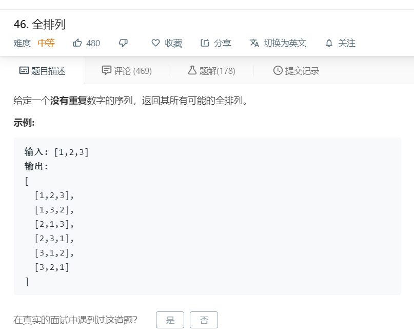

# 46.全排列
  

```
/**
 * @param {number[]} nums
 * @return {number[][]}
 */
var permute = function(nums) {
    if(nums.length <= 1){
        return [nums];
    }
    let temp = [];
    function mid(r,start,end){
        if(start == end-1){
            return;
        }

        for(let i=start;i<end;i++){
            [r[i],r[start]] = [r[start],r[i]];
            let one = r.slice(0);
            let two = one.join('');
            let num = 0;
            temp.forEach((el)=>{
                if(el.join('') == two){
                    num += 1;
                }
            })

            if(num == 0){
                temp.push(one);
            }
            mid(r,start+1,end);
            [r[start],r[i]] = [r[i],r[start]];
        }
    }

    mid(nums,0,nums.length);

    return temp;
};
```