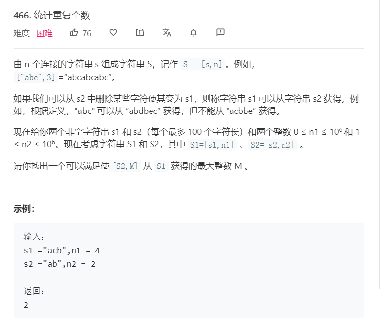

# 466.统计重复个数
  

```
/**
 * @param {string} s1
 * @param {number} n1
 * @param {string} s2
 * @param {number} n2
 * @return {number}
 */
var getMaxRepetitions = function(s1, n1, s2, n2) {
    let one = s1.split('');
    let two = s2.split('');

    console.log(one,two)
    let can = 0,index = 0;
    for(let j=0;j<n1;j++){
        for(let i = 0;i<one.length;i++){
            if(one[i] == two[index]){
                index++;
            }

            if(index == two.length){
                can++;
                index = 0;
            }
        }
    }

    console.log(Math.floor(can/n2))
    return Math.floor(can/n2);
};
```