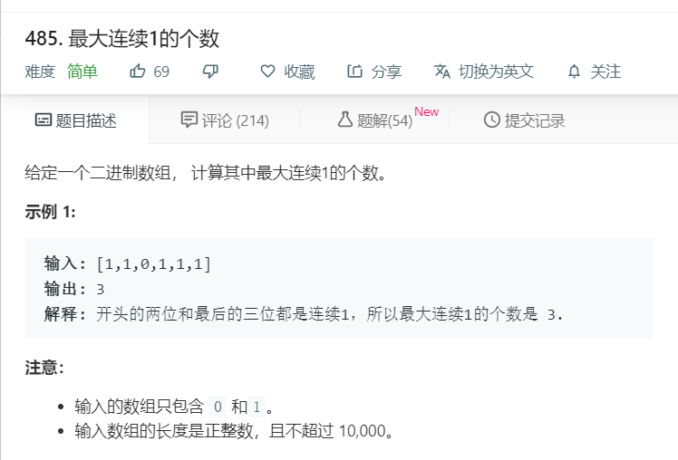

# 485.最大连续1的个数
  

```
/**
 * @param {number[]} nums
 * @return {number}
 */
var findMaxConsecutiveOnes = function(nums) {
    let temp = nums.join('').split('0');
    let result = 0;
    temp.forEach(ele =>{
      if(result < ele.length){
        result = ele.length;
      }
    })
    // console.log(result);
    return result;
};
```