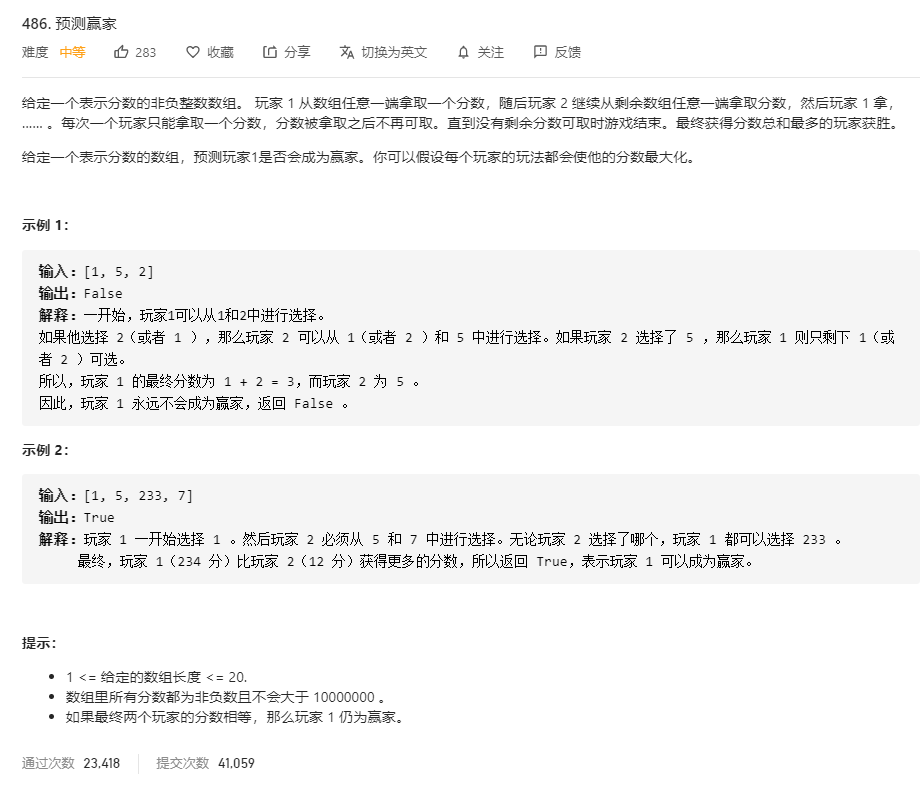

# 486.预测赢家
  

```
/**
 * @param {number[]} nums
 * @return {boolean}
 */
var PredictTheWinner = function(nums) {
    if (nums.length % 2 === 0) {
        return true;
    }

    const mid = (i, j) => {
        if (i === j) {
            return nums[i];
        }

        let left = nums[i] - mid(i+1, j);
        let right = nums[j] - mid(i, j - 1);

        return Math.max(left, right);
    }

    return mid(0, nums.length - 1) >= 0
};
```