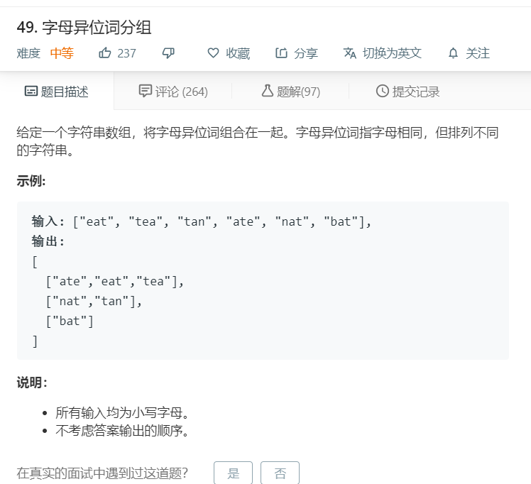

# 49.字母异位词分组
  

```
/**
 * @param {string[]} strs
 * @return {string[][]}
 */
var groupAnagrams = function(strs) {
    if(strs.length == 0){
        return strs;
    }
    let result = [],abouttrim = [];
    for(let i=0;i<strs.length;i++){
        let temp = strs[i].split('').sort().join('');
        
        if(temp.length == 0){
            abouttrim.push(temp);
            strs.splice(i,1);
            i--;
        }else{
            result.push(temp);
        }
    }

    let one = [];
    if(result.length != 0){   
        for(let i=0;i<result.length-1;i++){
            let two=[];
            two.push(strs[i])
            for(let j=i+1;j<result.length;j++){
                if(result[j].length == result[i].length && result[j].split(result[i]).length == 2){
                    two.push(strs[j]);
                    strs.splice(j,1);
                    result.splice(j,1);
                    j--;
                }
            }
            strs.splice(i,1);
            result.splice(i,1);
            i--;
            one.push(two);
        }
        console.log(strs)
        if(strs.length == 1){
            one.push([strs[0]]);
        }
    }
    if(abouttrim.length != 0){
        one.push(abouttrim);
    }
    console.log(one);
    return one;
};


```