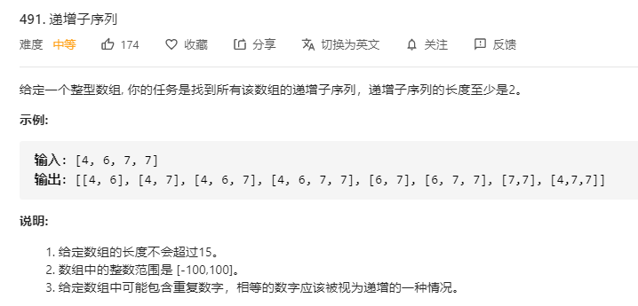

# 491.递增子序列
  

```
/**
 * @param {number[]} nums
 * @return {number[][]}
 */
var findSubsequences = function(nums) {
    let res = [], only = [];

    const mid = (nowArr, last) => {
        if (nowArr.length > 1) {
            if (only.length === 0 || only.indexOf(nowArr.join('*')) < 0) {
                res.push(nowArr.slice(0));
                only.push(nowArr.join('*'))
            }
        }

        for (let i=0;i<nums.length;i++) {
            if (i > last && (nowArr.length === 0 || nowArr[nowArr.length-1] <= nums[i])) {
                nowArr.push(nums[i]);
                mid(nowArr.slice(0), i);
                nowArr.pop();
            }
        }
    }

    mid([], -1);

    return res;
};
```