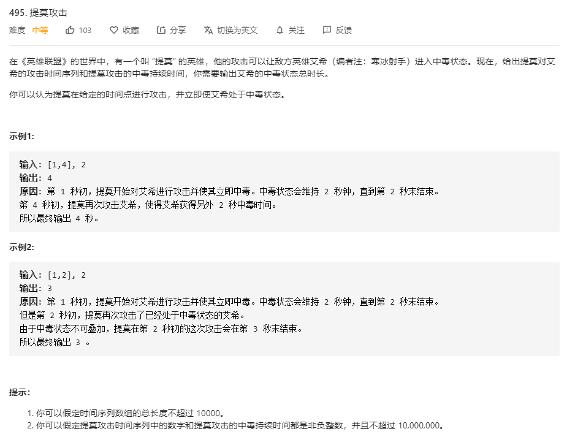

# 495.提莫攻击
  

```
/**
 * @param {number[]} timeSeries
 * @param {number} duration
 * @return {number}
 */
var findPoisonedDuration = function(timeSeries, duration) {
    let res = 0, lastTime = 0;

    timeSeries.map(el => {
        if (lastTime === 0 || lastTime <= el) {
            lastTime = el + duration;
            res += duration;
        } else {
            let temp = lastTime - el;
            temp = duration - temp;
            if (temp > 0) {
                lastTime += temp;
                res += temp;
            }
        }
    })

    console.log(res);
    return res;
};
```