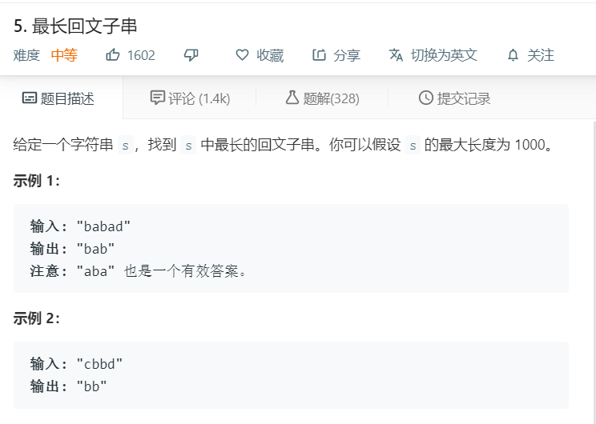

# 5.最长回文子串
  

```
/**
 * @param {string} s
 * @return {string}
 */
var longestPalindrome = function(s) {
    if(s.length <= 1){
        return s;
    }
    let temp = s.split('');
    let result = [];
    for(let i=0;i<temp.length;i++){
        let start = i-1,end=i+1;
        while(temp[start] == temp[end]){
            start--;
            end++;
            if(start < 0 || end > temp.length-1){
                break;
            }
        }
        result.push(temp.slice(start+1,end).join(''))
    }
    console.log(result);
    for(let i=0;i<temp.length-1;i++){
        let start = i,end=i+1;
        while(temp[start] == temp[end]){
            start--;
            end++;
            if(start < 0 || end > temp.length-1){
                break;
            }
        }
        if(start != i){
            result.push(temp.slice(start+1,end).join(''))
        }
    }
    console.log(result);
    let max = temp[0];
    result.forEach((el)=>{
        if(el.length > max.length){
            max = el;
        }
    })
    console.log(max);
    return max;
};
```