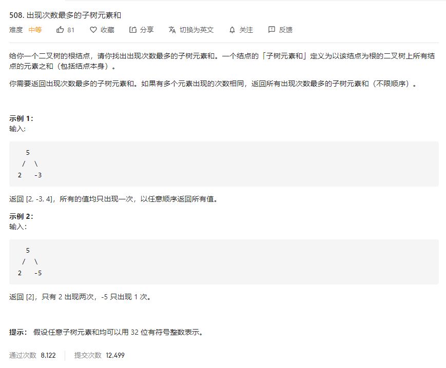

# 508.出现次数最多的子树元素和
  

```
/**
 * Definition for a binary tree node.
 * function TreeNode(val) {
 *     this.val = val;
 *     this.left = this.right = null;
 * }
 */
/**
 * @param {TreeNode} root
 * @return {number[]}
 */
var findFrequentTreeSum = function(root) {
    let res = new Map();
    const mid = (r) => {
        if (!r) {
            return 0;
        }

        let left = mid(r.left);
        let right = mid(r.right);

        let temp = left + right + r.val;
        if (res.has(temp)) {
            res.set(temp, res.get(temp) + 1)
        } else {
            res.set(temp, 1);
        }

        return temp;
    }

    mid(root);

    let all = [];

    res.forEach((val, key) => {
        if (all.length === 0) {
            all.push(key);
        } else {
            if (val > res.get(all[all.length - 1])) {
                all = [];
                all.push(key);
            } else if (val === res.get(all[all.length - 1])) {
                all.push(key);
            }
        }
    })

    console.log(all);

    return all;
};
```