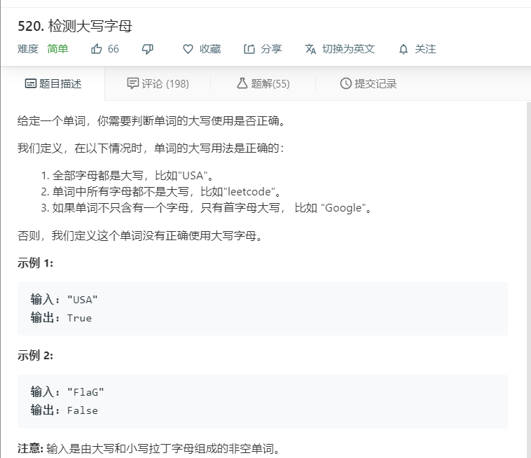

# 520.检测大写字母
  

```
/**
 * @param {string} word
 * @return {boolean}
 */
var detectCapitalUse = function(word) {
  let mate = word.replace(/[A-Z]/g,'');
  if(word.length == mate.length){
    return true;
  }
  if(mate.length == 0){
    return true;
  }

  if(word[0]+mate == word){
    return true;
  }
  return false;
};

```