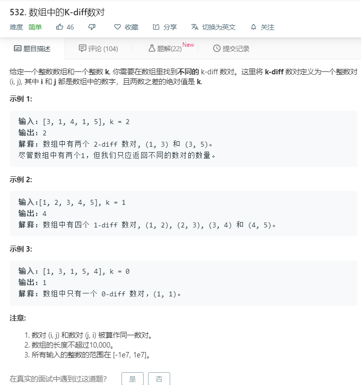

# 532.数组中的k-diff数对
  

```
/**
 * @param {number[]} nums
 * @param {number} k
 * @return {number}
 */
var findPairs = function(nums, k) {
  if(k<0){
      return 0;
  }
  let temp = nums.slice(0),result = 0;
  if(k == 0){
    let temps = [];
    nums.sort((a,b)=>a-b);
    for(let i=0;i<nums.length-1;i++){
      if(nums[i] == nums[i+1] && temps.indexOf(nums[i])<0){
        temps.push(nums[i]);
      }
    }
    return temps.length;
  }
  nums = [...new Set(nums)];
  for(let i=0;i<temp.length;i++){
    temp[i] = temp[i] - k;
  }
  temp = [...new Set(temp)];
  temp.forEach(element => {
    if(nums.indexOf(element)>=0){
      result += 1;
    }
  });
  console.log(result);
  return result;
};

```