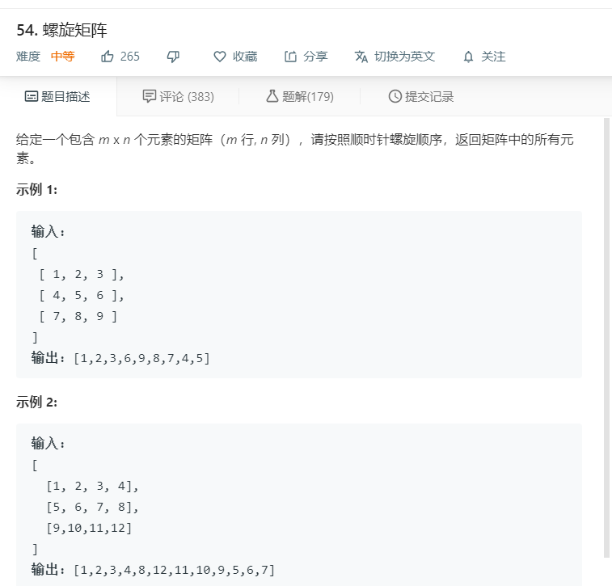

# 54.螺旋矩阵
  

```
/**
 * @param {number[][]} matrix
 * @return {number[]}
 */
var spiralOrder = function(matrix) {
    if(matrix.length == 0){
        return [];
    }

    let u = 0,d=matrix.length-1,l=0,r=matrix[0].length-1;
    let result = [];

    while(true){
        for(let i=l;i<=r;i++){
            result.push(matrix[u][i]);
        }
        if(++u > d)break;

        for(let i=u;i<=d;i++){
            result.push(matrix[i][r]);
        }
        if(--r < l)break;

        for(let i=r;i>=l;i--){
            result.push(matrix[d][i]);
        }
        if(--d < u)break;

        for(let i=d;i>=u;i--){
            result.push(matrix[i][l]);
        }
        if(++l > r)break;
    }

    
    console.log(u,d,l,r);
    return result;


};
```