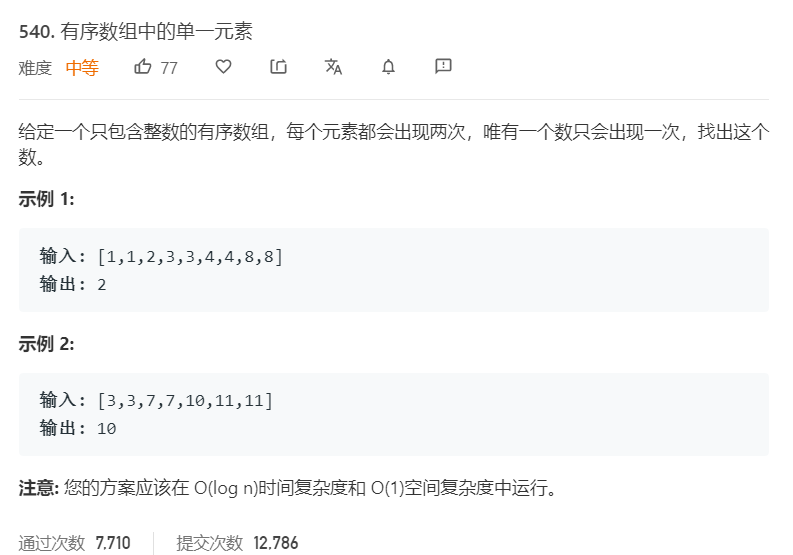

# 540.有序数组中的单一元素
  

```
/**
 * @param {number[]} nums
 * @return {number}
 */
var singleNonDuplicate = function(nums) {
    let temp = [];
    if(nums.length == 1){
        return nums[0]
    }
    for(let i=0;i<nums.length;i++){
        if(temp.length == 0){
            temp.push(nums[i]);
        }else if(temp[temp.length-1] == nums[i]){
            temp.pop();
        }else{
            return temp.pop();
        }
        if(i == nums.length-1){
            return temp.pop();
        }
    }
};
```