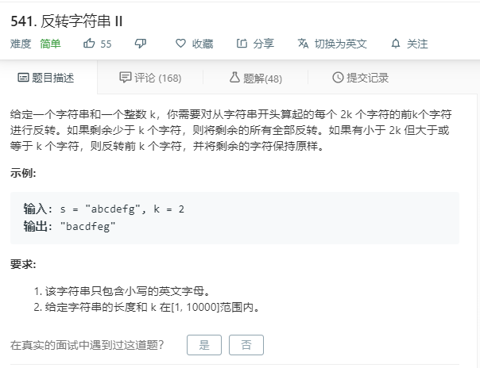

# 541.反转字符串II
  

```
/**
 * @param {string} s
 * @param {number} k
 * @return {string}
 */
var reverseStr = function(s, k) {
    let temp = s.split('');
    let result = [],one=[];
    for(let i=0;i<temp.length;i++){
        if(one.length < 2*k){
            one.push(temp[i]);
            if(i == temp.length - 1){
                if(one.length < k){
                    one.reverse();
                    result.push(one);
                }else{
                    let two = one.splice(0,k);
                    two.reverse();
                    result.push(two);
                    result.push(one);
                }
            }
        }else{
            let two = one.splice(0,k);
            two.reverse();
            result.push(two);
            result.push(one);
            one = [];
            one.push(temp[i]);
             if(i == temp.length - 1){
                if(one.length < k){
                    one.reverse();
                    result.push(one);
                }else{
                    let two = one.splice(0,k);
                    two.reverse();
                    result.push(two);
                    result.push(one);
                }
            }
        }
    }

    result.forEach((el,index)=>{
        result[index] = el.join('');
    })

    return result.join('');
};
```