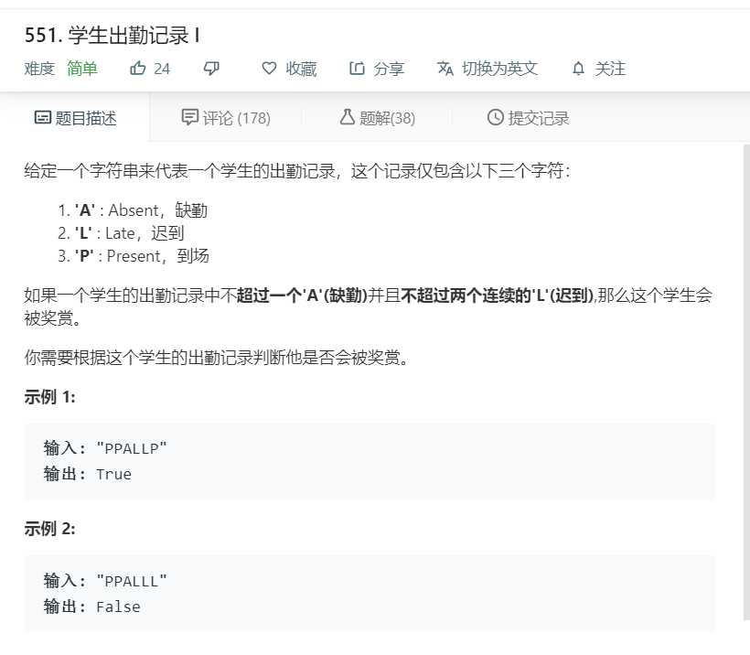

# 551.学生出勤记录I
  

```
/**
 * @param {string} s
 * @return {boolean}
 */
var checkRecord = function(s) {
    let one,two=[];
    one = s.split('A').length;
    two = s.split('LLL').length;
    console.log(one,two);
    if(one <= 2 && two < 2){
        return true;
    }else{
        return false;
    }
};
```