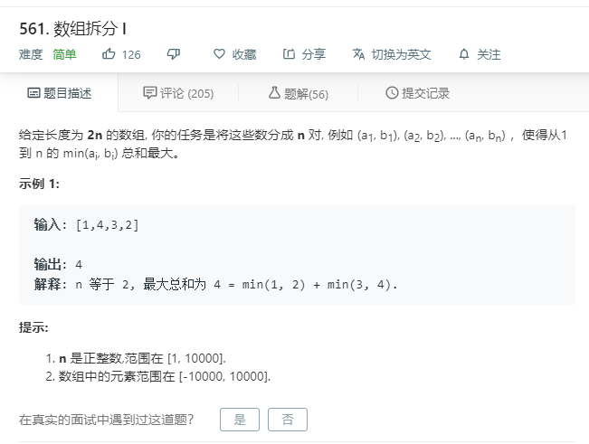

# 561.数组拆分I
  

```
/**
 * @param {number[]} nums
 * @return {number}
 */
var arrayPairSum = function(nums) {
    nums.sort((a,b)=>a-b);
    let result = 0;
    for(let i=0;i<nums.length;i=i+2){
        result += nums[i];
    }

    return result;
};
```