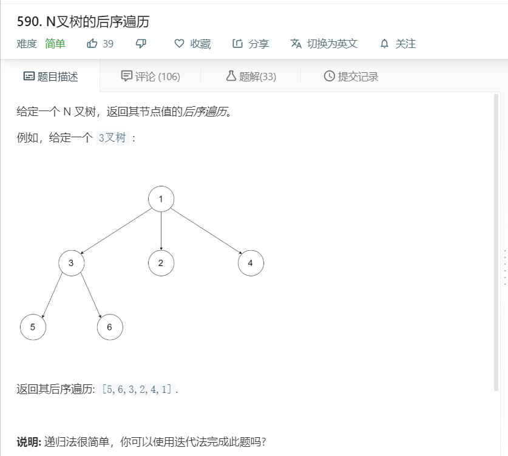

# 590.N叉树的后序遍历
  

```
/**
 * // Definition for a Node.
 * function Node(val,children) {
 *    this.val = val;
 *    this.children = children;
 * };
 */
/**
 * @param {Node} root
 * @return {number[]}
 */
var postorder = function(root) {
    let temp = [];
    function mid(r){
        if(!r){
            return;
        }
        for(let i=0;i<r.children.length;i++){
            mid(r.children[i]);
        }
        temp.push(r.val);
    }

    mid(root);
    return temp;
};
```