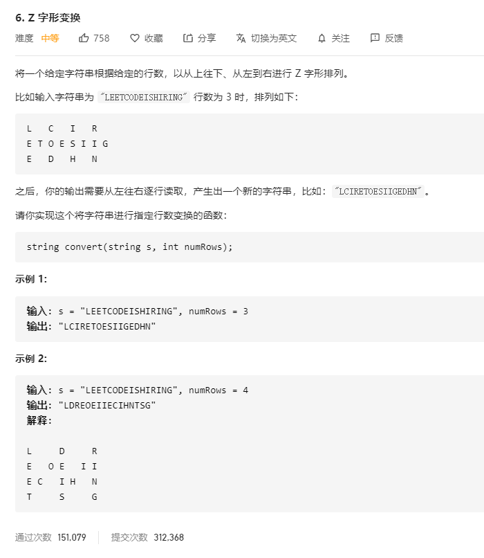

# 6.Z字形变换
  

```
/**
 * @param {string} s
 * @param {number} numRows
 * @return {string}
 */
var convert = function(s, numRows) {
    if(numRows === 1) {
        return s;
    }
    let res = [];

    while(res.length < numRows) {
        res.push([]);
    }

    s = s.split('');

    let pos = 0, direction = 0;

    

    while(s.length > 0) {
        // console.log(res, pos, direction)
        if(pos <= res.length - 1 && direction === 0) {
            res[pos].push(s.shift());
            pos++;
        } 

        if(direction === 1 && pos > 0 && pos < res.length - 1) {
            res[pos].push(s.shift());
            pos--;
        }

        if(pos === res.length && direction === 0) {
            direction = 1;
            pos -= 2;
        }

        if(pos === 0 && direction === 1) {
            direction = 0;
        }

        //  console.log(res, pos)
    }

    // console.log(res);

    let result = '';

    for(let i=0;i<res.length;i++) {
        result += res[i].join('');
    }

    console.log(result);

    return result;
};
```