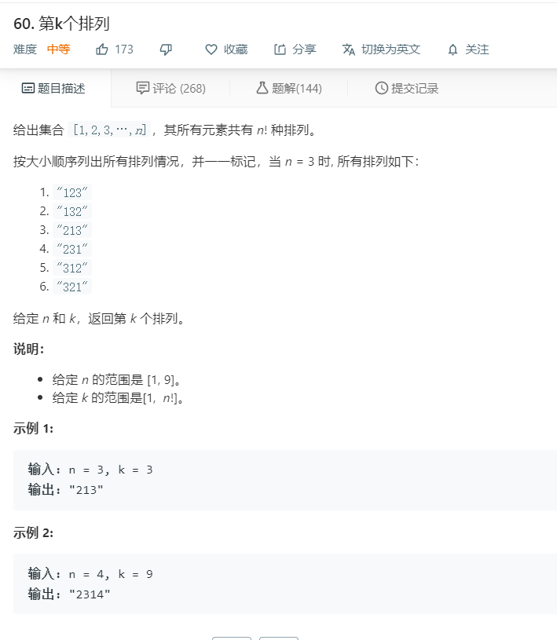

# 60.第k个排列
  

```
/**
 * @param {number} n
 * @param {number} k
 * @return {string}
 */
var getPermutation = function(n, k) {
    let temp = [],list = [],need = [];

    for(let i=1;i<=n;i++){
        need.push(i);
    }

    var permute = function(nums) {
        let temp = [],list=[];
        let one = (list,who,start)=>{
            if(list.length == nums.length){
                temp.push(+list.join(''));
                return;
            }

            for(let i=0;i<who.length;i++){
                if(start.indexOf(i)<0){
                    list.push(who[i]);
                    start.push(i);
                    //不设置长度减枝的话会超时
                    if(temp.length < k){
                        one(list.slice(),who,start);
                    }
                    start.pop();
                    list.pop();
                }
            }
        }

        one(list,nums.slice(),[]);
        return temp;
    };

    let now = permute(need);

    return now[k-1] + '';
};
```