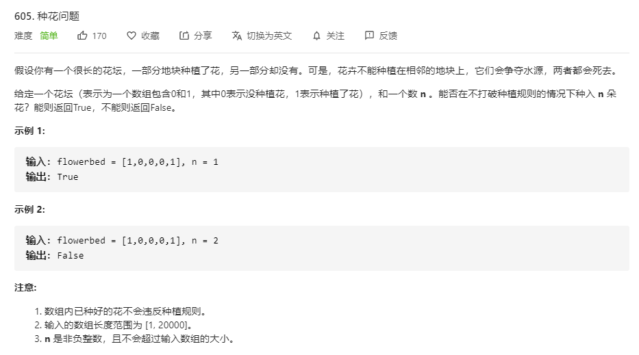

# 605.种花问题
  

```
/**
 * @param {number[]} flowerbed
 * @param {number} n
 * @return {boolean}
 */
var canPlaceFlowers = function(flowerbed, n) {
    flowerbed.map((el,index) => {
        if (index === 0 && flowerbed[index + 1] !== 1 && el === 0) {
            flowerbed[0] = 1;
            n--;
        }

        else if (index - 1 > -1 
                && flowerbed[index - 1] !== 1 
                && flowerbed[index + 1] !== 1
                && el === 0) {
            flowerbed[index] = 1;
            n--;
        }
    })

    console.log(flowerbed, n)
    return n <= 0 ? true : false;
};
```