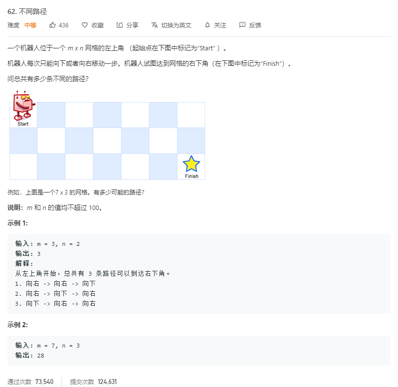
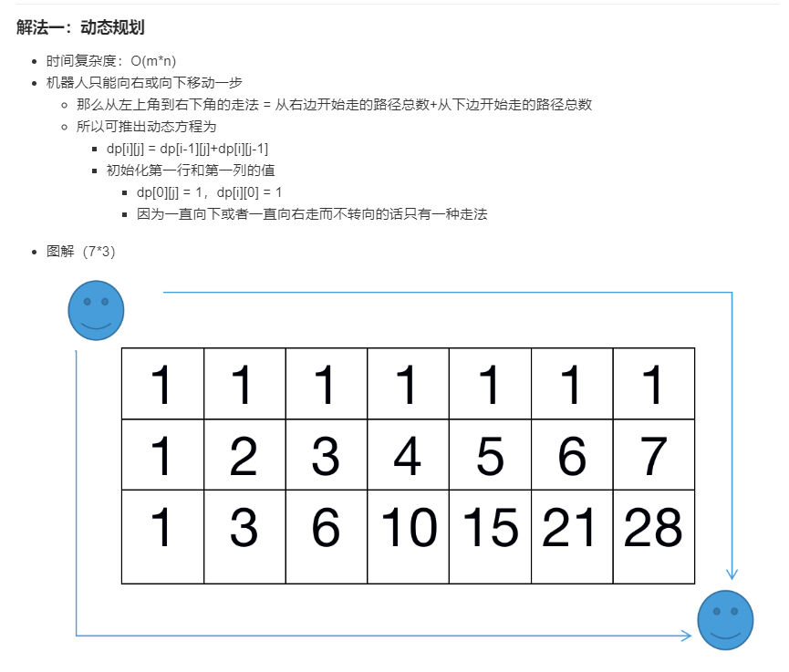

# 62.不同路径
  

   

```
/**
 * @param {number} m
 * @param {number} n
 * @return {number}
 */
var uniquePaths = function(m, n) {
    let temp = new Array(m);
    for(let i=0;i<m;i++){
        temp[i] = new Array(n);
        temp[i][0] = 1;
    }

    for(let i=0;i<n;i++){
        temp[0][i] = 1;
    }

    for(let i=1;i<m;i++){
        for(let j=1;j<n;j++){
            temp[i][j] = temp[i-1][j] + temp[i][j-1];
        }
    }
    console.log(temp,temp[m-1][n-1])
    return temp[m-1][n-1];
};
```