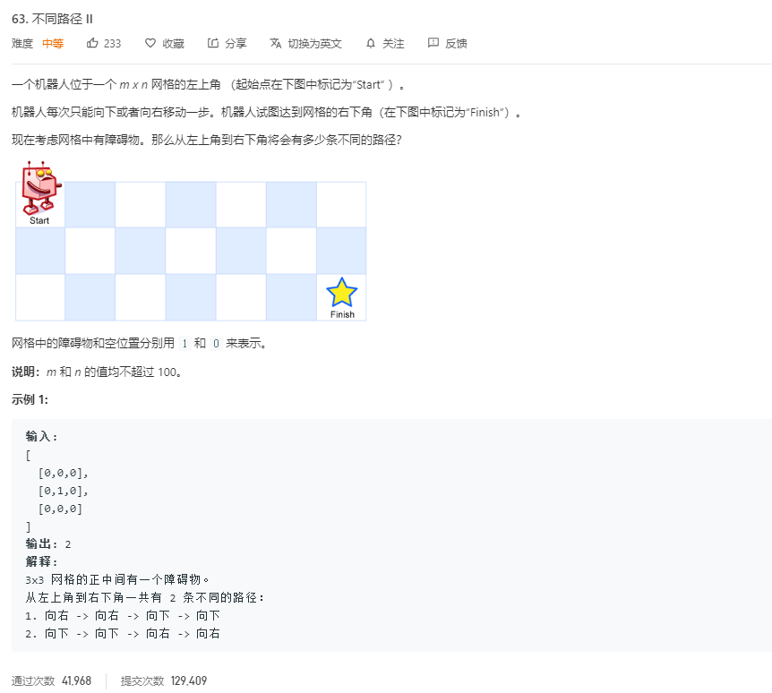

# 63.不同路径II
  

```
/**
 * @param {number[][]} obstacleGrid
 * @return {number}
 */
var uniquePathsWithObstacles = function(obstacleGrid) {
    let m = obstacleGrid.length,n = obstacleGrid[0].length;
    if(m == 0 || n== 0 || obstacleGrid[0][0] == 1){
        return 0;
    }
     let temp = new Array(m);
     temp[0] = new Array(n);
     temp[0][0] = 1;

     //obstacleGrid[i][0] == 1 ? 0 : temp[i-1][0]
     //这样才能确保没有道路不通时初始化没出错
    for(let i=1;i<m;i++){
        temp[i] = new Array(n);
        temp[i][0] = obstacleGrid[i][0] == 1 ? 0 : temp[i-1][0];
    }

    for(let i=1;i<n;i++){
        temp[0][i] = obstacleGrid[0][i] == 1 ? 0 : temp[0][i-1];
    }

    console.log(temp)
    for(let i=1;i<m;i++){
        for(let j=1;j<n;j++){
            if(obstacleGrid[i][j] == 1){
                temp[i][j] = 0;
            }else{
                temp[i][j] = temp[i-1][j] + temp[i][j-1];
            }
        }
    }
    console.log(temp,temp[m-1][n-1])
    return temp[m-1][n-1];
};
```