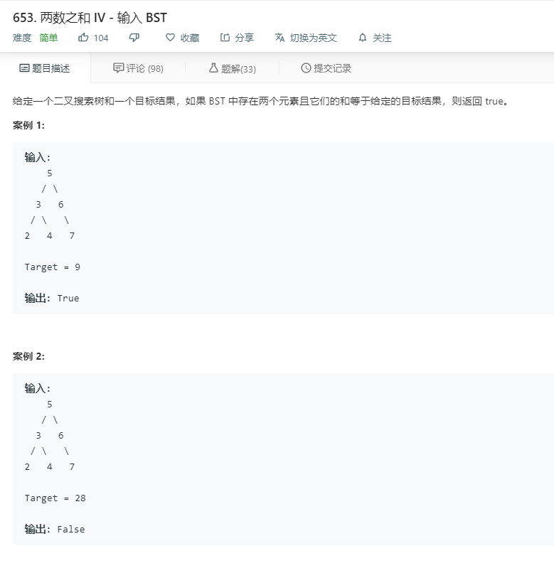

# 653.两数之和IV输入BST
  

```
/**
 * Definition for a binary tree node.
 * function TreeNode(val) {
 *     this.val = val;
 *     this.left = this.right = null;
 * }
 */
/**
 * @param {TreeNode} root
 * @param {number} k
 * @return {boolean}
 */
var findTarget = function(root, k) {
    let temp = [];
    function mid(r){
        if(!r){
            return;
        }

        temp.push(r.val);
        mid(r.left);
        mid(r.right);
    }

    mid(root);
    let two = temp.slice(0);
    console.log(temp,two);
    for(let i=0;i<temp.length;i++){
        temp[i] = k - temp[i];
    }

    let only = 0;
    temp.forEach((el,index)=>{
        if(two.indexOf(el)>=0 && two.indexOf(el)!=index){
            only += 1;
        }
    })

    console.log(temp,two,only);

    if(only > 0){
        return true;
    }
    return false;
};
```