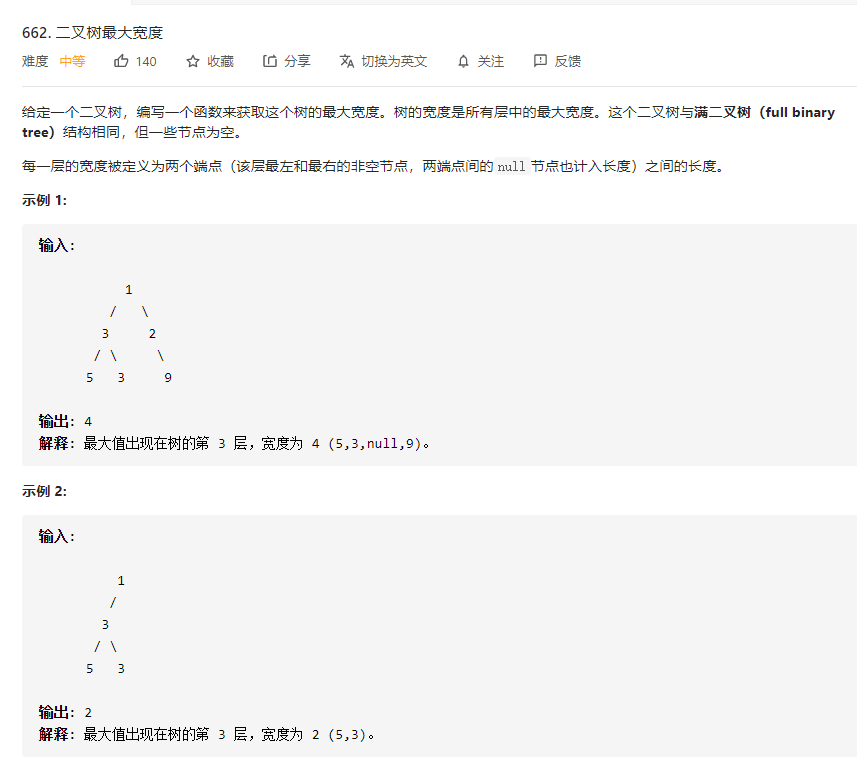
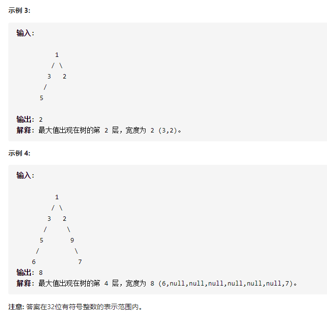

# 662.二叉树最大宽度
  

  

```
/**
 * Definition for a binary tree node.
 * function TreeNode(val, left, right) {
 *     this.val = (val===undefined ? 0 : val)
 *     this.left = (left===undefined ? null : left)
 *     this.right = (right===undefined ? null : right)
 * }
 */
/**
 * @param {TreeNode} root
 * @return {number}
 */
var widthOfBinaryTree = function(root) {
    let res = new Map(), max = 1;

    const mid = (r, hei, val) => {
        if (r) {
            if (!res.has(hei)) {
                res.set(hei, []);
            }

            let can = Math.pow(2, 32) - 1 ;
            res.get(hei).push(val);

            r.left && mid(r.left, hei + 1, (val * 2 - 1) % can);
            r.right && mid(r.right, hei + 1, (val * 2) % can);
        }
    }

    mid(root, 0, 1);

    res.forEach((el, index) => {
        let now = el[el.length-1] - el[0] + 1;
        max = now > max ? now : max;
    })


    return max;
};
```