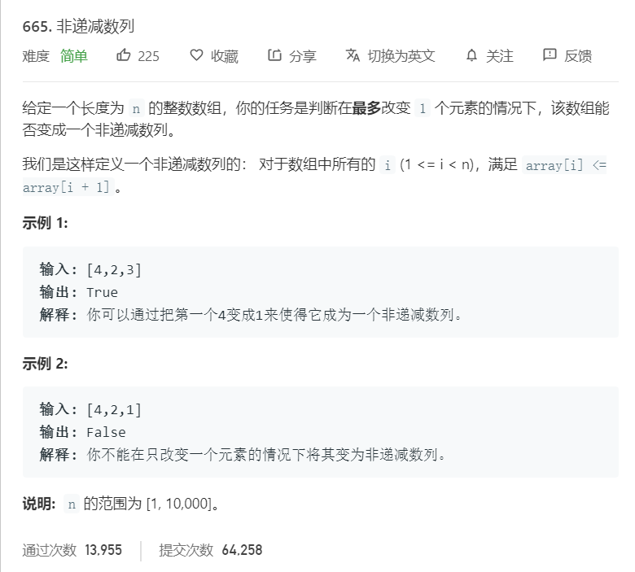

# 665.非递减数列
  

```
/**
 * @param {number[]} nums
 * @return {boolean}
 */
var checkPossibility = function(nums) {
        let count = 0;
    // 即找到一个元素 （大于其后面的那个元素）
    // 此时有两种情况
    // 1、改变该元素才能成为非递减序列
    // 2、改变该元素后面那个元素才能成为非递减序列
        for(let i = 1; i < nums.length; i++)
        {
            if(nums[i-1] > nums[i])
            {
                if(i-2 >= 0 && nums[i-2] > nums[i])
                    nums[i] = nums[i-1];
                else
                    nums[i-1] = nums[i];
                count++;
            }
        }
        return count <= 1;
};
```