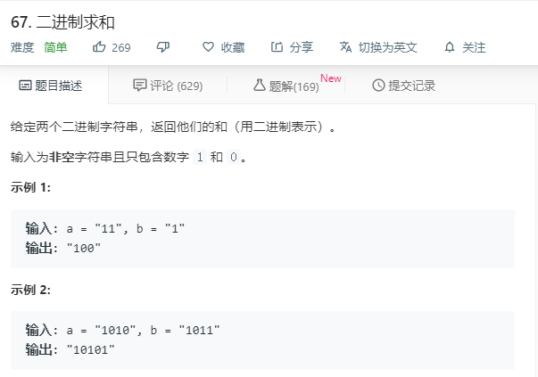

# 67.二进制求和
  

```
/**
 * @param {string} a
 * @param {string} b
 * @return {string}
 */
var addBinary = function(a, b) {
    let one = a.split('').reverse();
    let two = b.split('').reverse();
    let min = Math.min(one.length,two.length);
    let temp = [0],
        result = [];
    for(let i = 0;i<min;i++){
      let num = parseInt(one[i])+parseInt(two[i])+temp[0];
      if(num >= 2){
        result.push(num%2);
        temp[0] = 1;
        if(one.length == two.length && i == min-1){
          result.push(1);
        }
      }else{
        result.push(num);
        temp[0] = 0;
      }
    }
    
    if(one.length > two.length){
      for(let i = min;i<one.length;i++){
        let num = parseInt(one[i])+temp[0];
          if(num >= 2){
            result.push(num%2);
            temp[0] = 1;
            if(i == one.length - 1){
              result.push(1);
            }
          }else{
            result.push(num);
            temp[0] = 0;
          }
      }
    }

    if(one.length < two.length){
      for(let i = min;i<two.length;i++){
        let num = parseInt(two[i])+temp[0];
          if(num >= 2){
            result.push(num%2);
            temp[0] = 1;
            if(i == two.length - 1){
              result.push(1);
            }
          }else{
            result.push(num);
            temp[0] = 0;
          }
      }
    }
    return result.reverse().join('');
};

```