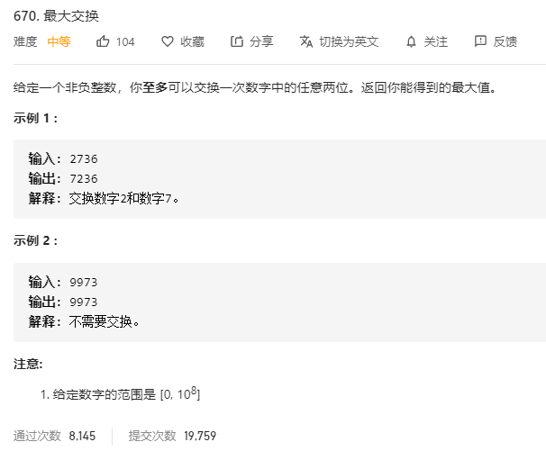

# 670.最大交换
  

```
/**
 * @param {number} num
 * @return {number}
 */
var maximumSwap = function(num) {
    let temp = [], who = [];

    num = (num + '').split('');

    for(let i=0;i< num.length;i++) {
        if (temp.length === 0 || temp[temp.length-1] >= (+num[i])) {
            temp.push(num[i]);
            who.push(i);
        } else {
            break;
        }
    }

    if (who.length === num.length) {
        return +num.join('');
    } else {
        let max = -Infinity, resWho = who.length;
        for (let i=who.length;i<num.length;i++) {
            if (max <= (+num[i])) {
                max = (+num[i]);
                resWho = i;
            }
        }

        console.log(resWho, max)

        for (let i=0;i<who.length;i++) {
            if ((+num[i]) < max) {
                [num[i], num[resWho]] = [num[resWho], num[i]];
                break;
            }
        }

        return +num.join("");
    }
};
```