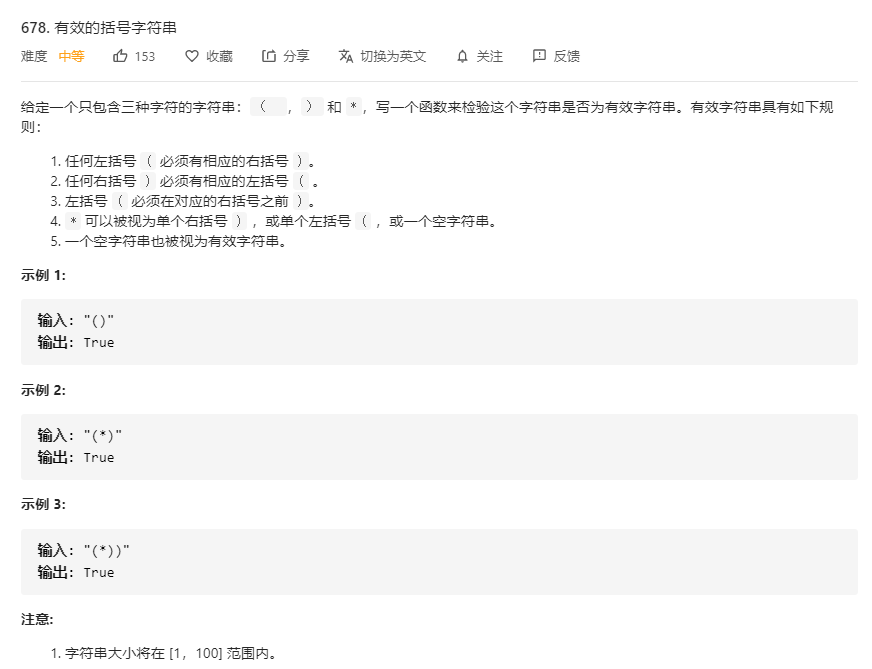

# 678.有效的括号字符串
  

```
/**
 * @param {string} s
 * @return {boolean}
 */
var checkValidString = function(s) {
    s = s.split('');

    let temp = 0, res = [];

    s.map((el) => {
        if (res === 0) {
            res.push(el);
        } else {
            let pos = res.lastIndexOf('(');
            let other = res.lastIndexOf('*');
            if (el === ')' && pos > -1) {
                res.splice(pos, 1);
            } else if (el === ')' && pos < 0 && other > -1) {
                res.splice(other, 1);
            }
            else {
                res.push(el);
            }
        }
    })

    while(res.lastIndexOf('(') > -1) {
        let pos = res.lastIndexOf('(');
        let other = res.lastIndexOf('*');
        if (pos < other) {
            res.splice(pos, 1);
            let other = res.lastIndexOf('*');
            res.splice(other, 1);
        } else {
            break;
        }
    }

    console.log(res);
    if (res.indexOf('(') < 0 && res.indexOf(')') < 0) {
        return true;
    }

    return false;
};
```