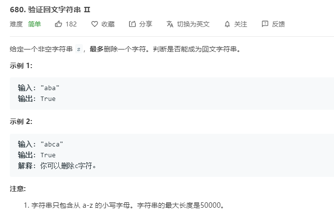

# 680.验证回文字符串II
  

```
/**
 * @param {string} s
 * @return {boolean}
 */
var validPalindrome = function(s) {
    s = s.split('');

    let m = s.length-1;
    if(s.length == 0){
        return true;
    }
    let mid = s.length >> 1;

    let count = 0;

    let one = (start,end) => {
        for(let i=start;i<mid;i++) {
            if(s[i] != s[end-i]) {
                if(s[i+1] == s[end-i] && s[i] != s[end-i-1]) {
                    count++;
                    i++;
                    end++;
                }else if(s[i+1] != s[end-i] && s[i] == s[end-i-1]) {
                    end--;
                    count++
                }else if(s[i+1] == s[end-i] && s[i] == s[end-i-1]) {
                    one(i+1,end + 1);
                    one(i,end-1);
                }else {
                    console.log(i,s[i],s[end-i]);
                    return false;
                }
            }

            if(count > 1) {
                console.log(mid,i,s[i],s[end-i]);
                return false;
            }
        }

        return true;
    }

    let re = one(0,m);
    if(!re) {
        return false; 
    }
    return true;
};

```