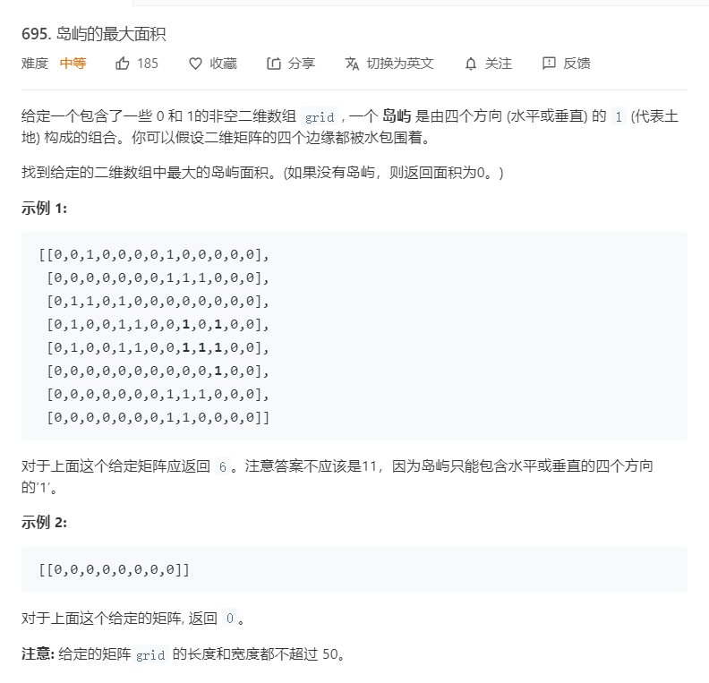

# 695.岛屿的最大面积
  

```
/**
 * @param {number[][]} grid
 * @return {number}
 */
var maxAreaOfIsland = function(grid) {
    let m = grid.length,n = grid[0].length;
    if(m == 0){
        return 0;
    }

    // 每次调用的时候默认num为1，进入后判断如果不是岛屿，则直接返回0，就可以避免预防错误的情况。
    // 每次找到岛屿，则直接把找到的岛屿改成0，这是传说中的沉岛思想，就是遇到岛屿就把他和周围的全部沉默。
    let one = (i,j,g) => {
        if(i < 0 || j < 0 || i >= m || j >= n || g[i][j] == 0){
            return 0;
        }
        let num = 1;
        g[i][j] = 0;
        num += one(i+1,j,g);
        num += one(i,j+1,g);
        num += one(i-1,j,g);
        num += one(i,j-1,g);
        return num;
    }

    let result = 0;
    for(let i=0;i<m;i++){
        for(let j=0;j<n;j++){
            result = Math.max(result,one(i,j,grid));
        }
    }

    return result;
};
```