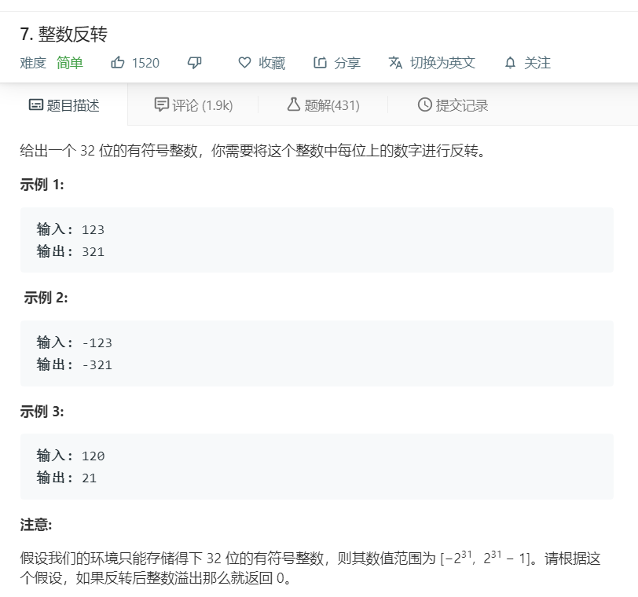

# 7.整数反转
  

```
/**
 * @param {number} x
 * @return {number}
 */
var reverse = function(x) {
    let max = Math.pow(2,31);
    if(x < max && x > -max){
      let temp = (x + '').split('');
        let zero = temp.length - 1;
        let start = 0,result = [];
        if(temp[zero] == 0){
          while(temp[zero--]!=0){}
        }
        if(x < 0){
          start = 1;
        }

        for(let i = zero;i>=start;i--){
          result.push(temp[i]);
        }
        if(x < 0){
          result.unshift('-');
        }
        let only = result.join('');
        if(only < max && only > -max){
            return only;
        }else{
            return 0;
        }
    }else{
        return 0;
    }
    
};
```