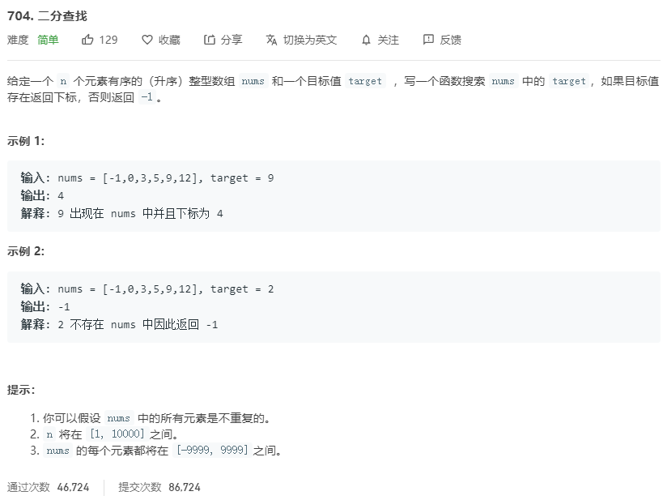

# 704.二分查找
  

```
/**
 * @param {number[]} nums
 * @param {number} target
 * @return {number}
 */
var search = function(nums, target) {
    let left = 0,right = nums.length;
    let mid = (right - left) >> 1;

    console.log(left,right,mid);

    while(target != nums[mid] && left < right){
        if(target > nums[mid]){
            left = mid + 1;
        }else if(target < nums[mid]){
            right = mid - 1;
        }
        // console.log(left,right,mid);
        mid = Math.floor((right - left) / 2) + left;
    }

    console.log(mid);

    if(target == nums[mid]){
        return mid;
    }else{
        return -1;
    }
};
```