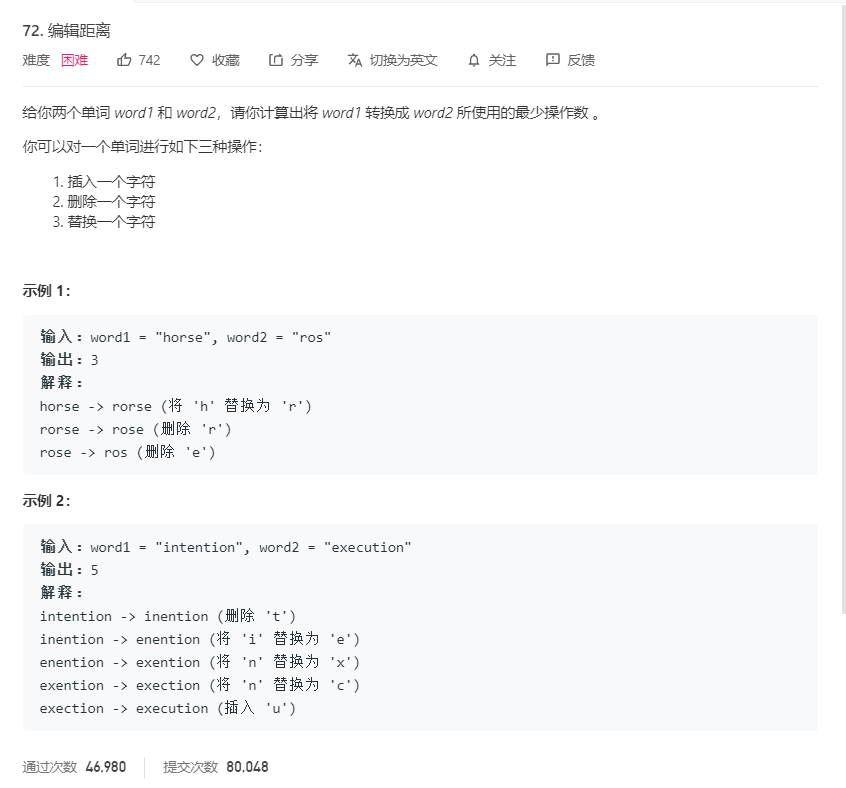

# 72.编辑距离
  

```
/**
 * @param {string} word1
 * @param {string} word2
 * @return {number}
 */
var minDistance = function(word1, word2) {
    let len1 = word1.length,len2 = word2.length;
    let result = new Array(len1 + 1);
    for(let i=0;i<result.length;i++){
        result[i] = new Array(len2 + 1);
    }

    for(let i=0;i<len1+1;i++){
        result[i][0] = i;
    }

    for(let i=0;i<len2+1;i++){
        result[0][i] = i;
    }

    for(let i=1;i<len1 + 1;i++){
        for(let j=1;j<len2+1;j++){
            if(word1[i-1] == word2[j-1]){
                result[i][j] = result[i-1][j-1];
            }else{
                result[i][j] = Math.min(result[i-1][j-1],result[i][j-1],result[i-1][j]) + 1;
            }
        }
    }

    return result[len1][len2]
};
```