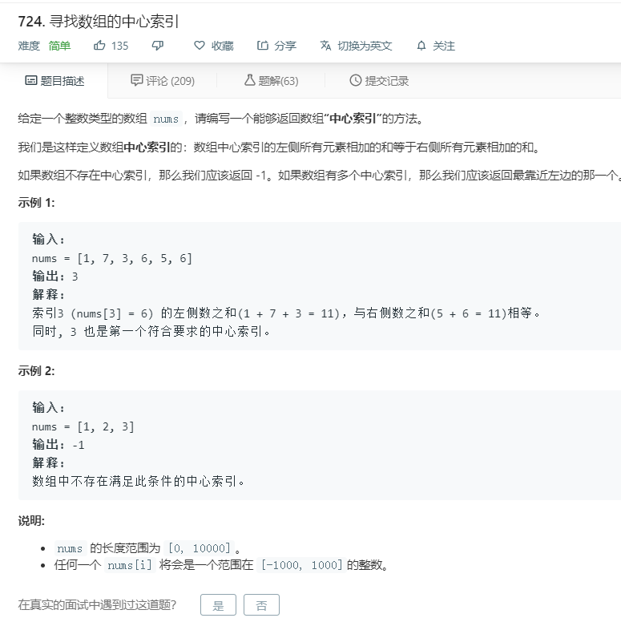

# 724.寻找数组的中心索引
  

```
/**
 * @param {number[]} nums
 * @return {number}
 */
var pivotIndex = function(nums) {
    let mid = 0;
    for(let i=0;i<nums.length;i++){
        let one = nums.slice(0,i).reduce((re,la)=>re+la,0);
        let two = nums.slice(i+1,nums.length).reduce((re,la)=>re+la,0);
        console.log(one,two);
        if(one == two){
            return i;
        }
    }
    return -1;
};
```