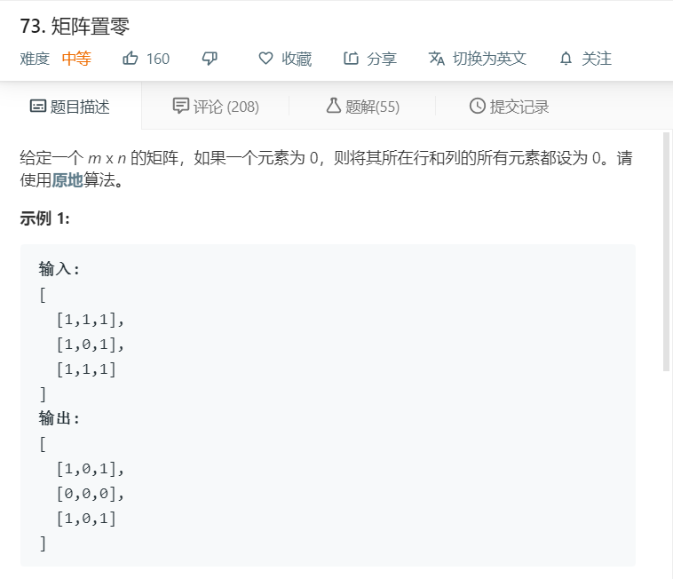
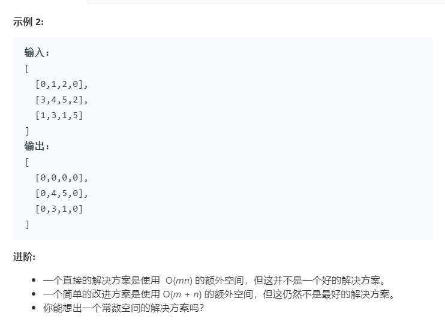

# 73.矩阵置零
  

  

```
/**
 * @param {number[][]} matrix
 * @return {void} Do not return anything, modify matrix in-place instead.
 */
var setZeroes = function(matrix) {
    let one = [],two = [];
    for(let i=0;i<matrix.length;i++){
        for(let j=0;j<matrix[i].length;j++){
            if(matrix[i][j]==0){
                one.push(i);
                two.push(j);
            }
        }
    }

    for(let i=0;i<matrix.length;i++){
        for(let j=0;j<matrix[i].length;j++){
            if(one.indexOf(i)>=0 || two.indexOf(j)>=0){
                matrix[i][j]=0;
            }
        }
    }

    return matrix;
};
```