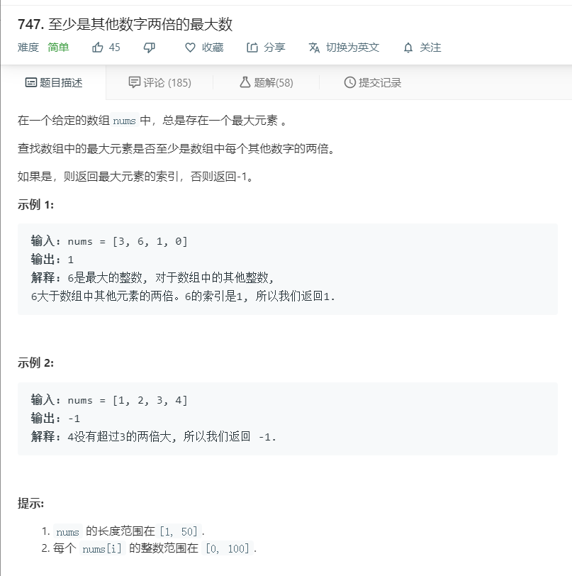

# 747.至少是其他数字两倍的最大数
  

```
/**
 * @param {number[]} nums
 * @return {number}
 */
var dominantIndex = function(nums) {
    if(nums.length == 1){
        return 0;
    }
    let one=0,two=0;
    let temp = nums.slice(0);
    nums.sort((a,b)=>a-b);
    one = nums[nums.length-1];
    two = nums[nums.length-2];
    if(one >= two*2){
        return temp.indexOf(one);
    }

    return -1;
};
```