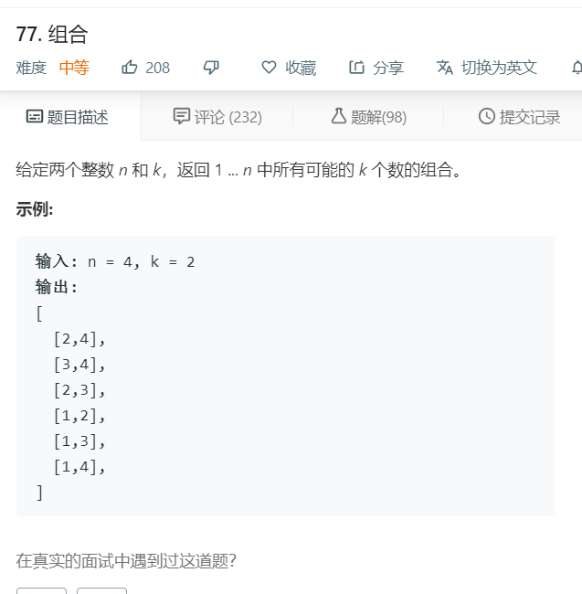

# 77.组合
  

```
/**
 * @param {number} n
 * @param {number} k
 * @return {number[][]}
 */
var combine = function(n, k) {
    let result = [],list=[];
    backtracking(1,list);
    function backtracking(start,list){
        if(list.length==k){
            result.push(list.slice(0));
            return;
        }else{
            for(let i=start;i<=n;i++){
                list.push(i);
                backtracking(i+1,list);
                list.pop();
            }
        }
    }
    console.log(result);
    return result;
};
```