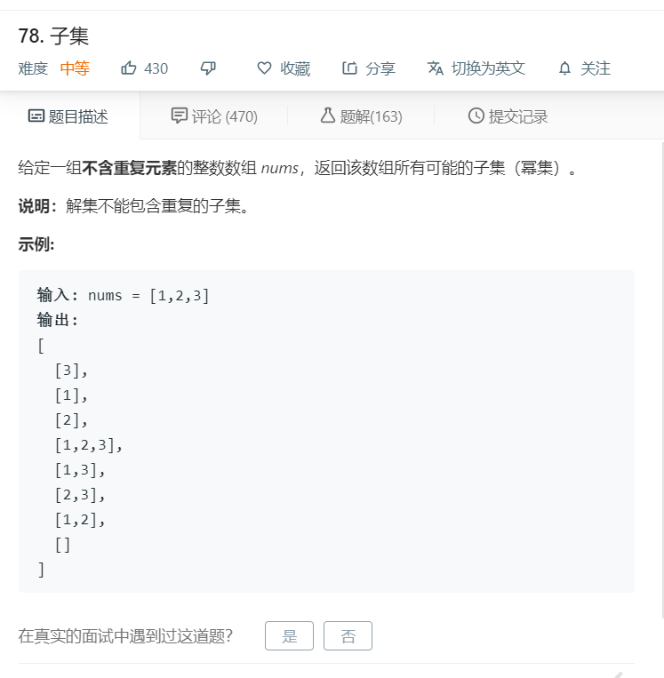

# 78.子集
  

```
/**
 * @param {number[]} nums
 * @return {number[][]}
 */
var subsets = function(nums) {
    let temp = [[]];

    for(let i=0;i<nums.length;i++){
        for(let j=0,len=temp.length;j<len;j++){
            temp.push(temp[j].concat(nums[i]));
        }
    }

    return temp;
};
```