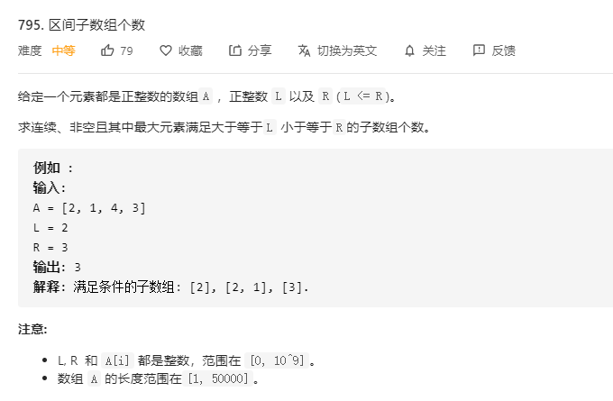

# 795.区间子数组个数
  

```
/**
 * @param {number[]} A
 * @param {number} L
 * @param {number} R
 * @return {number}
 */
var numSubarrayBoundedMax = function(A, L, R) {
    let res = [];

    for (let i = 0; i< A.length;i++) {
        let now = [];
        for (let j=i;j<A.length;j++) {
            now.push(A[j]);
            let max = Math.max(...now);
            if (max >= L && max <= R) {
                res.push(now.slice());
            }
            if (max > R) {
                break;
            }
        }
    }


    // console.log(res);
    return res.length;
};
```