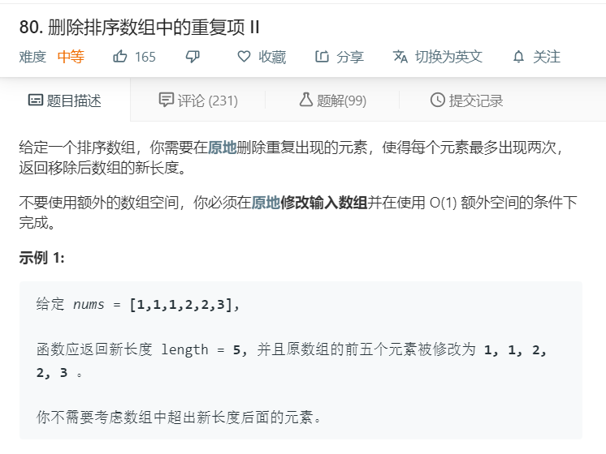
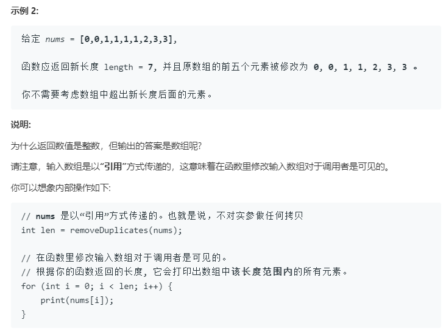

# 80.删除排序数组中的重复项II
  

  

```
/**
 * @param {number[]} nums
 * @return {number}
 */
var removeDuplicates = function(nums) {
    for(let i=0;i<nums.length-1;i++){
        if(nums[i] == nums[i+1] && nums.lastIndexOf(nums[i])!=i+1){
            nums.splice(i,1);
            console.log(nums.lastIndexOf(nums[i]))
            i--;
        }
    }
    return nums.length;
};
```