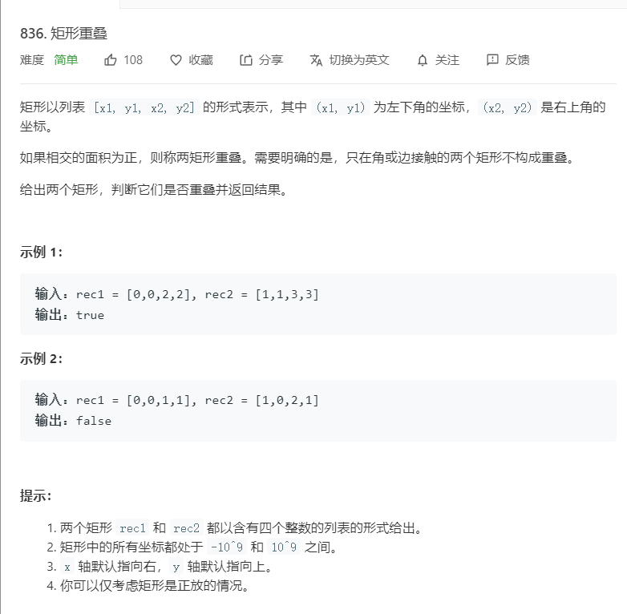

# 836.矩阵重叠
  

## 投影的运用
```
/**
 * @param {number[]} rec1
 * @param {number[]} rec2
 * @return {boolean}
 */
var isRectangleOverlap = function(rec1, rec2) {
    return (Math.min(rec1[2],rec2[2]) > Math.max(rec1[0],rec2[0])) && 
            (Math.min(rec1[3],rec2[3]) > Math.max(rec1[1],rec2[1]))
};
```

```
/**
 * @param {number[]} rec1
 * @param {number[]} rec2
 * @return {boolean}
 */
var isRectangleOverlap = function(rec1, rec2) {
    return !(rec1[0]>=rec2[2] || rec1[2]<=rec2[0] || rec1[1] >= rec2[3] || rec1[3] <=rec2[1] )
};
```