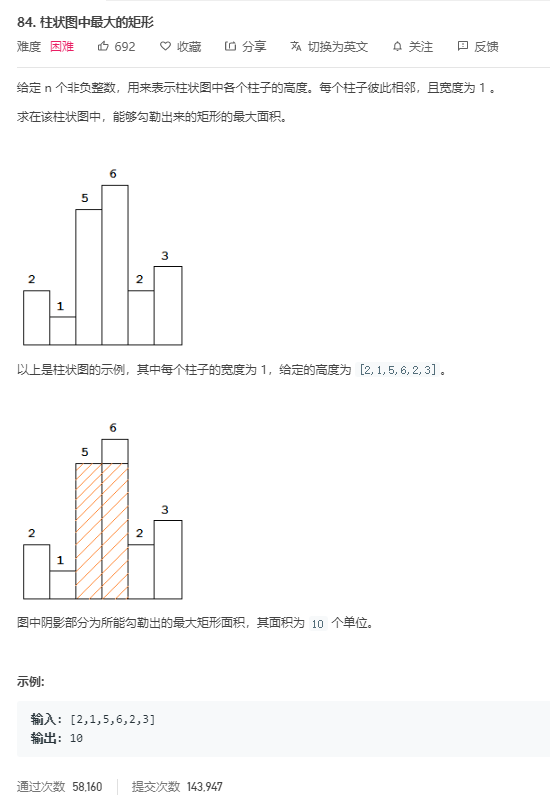

# 84.柱状图中最大的矩形
  

```
/**
 * @param {number[]} heights
 * @return {number}
 */
var largestRectangleArea = function(heights) {
    if(heights.length == 0) {
        return 0;
    }
    let max = heights[0];

    heights.map((el,index) => {
        let now = el;
        let left = index - 1,
            right = index + 1;
        while(left >= 0 && heights[left] >= el) {
            now += el;
            left--;
        }

        while(right < heights.length && heights[right] >= el) {
            now += el;
            right++;
        }

        if(max < now) {
            max = now;
        }
    })

    return max;
};
```