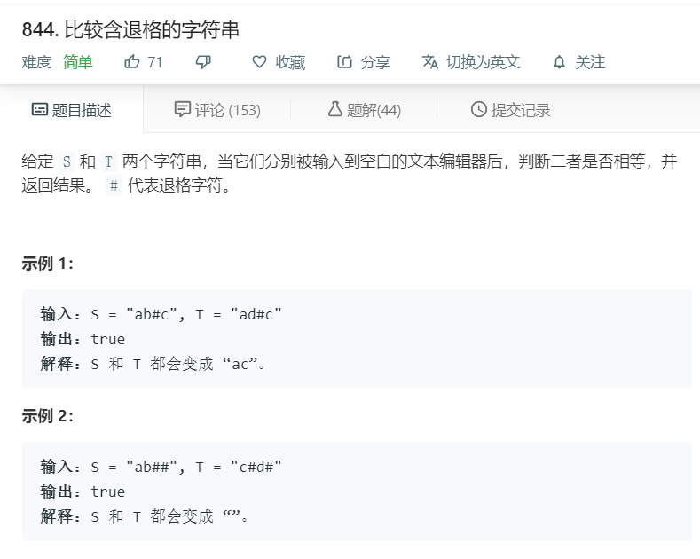

# 844.比较含退格的字符串
  

```
/**
 * @param {string} S
 * @param {string} T
 * @return {boolean}
 */
var backspaceCompare = function(S, T) {
    let one = [],two=[];
    for(let i of S){
        if(i == '#'){
            one.pop();
        }else{
            one.push(i);
        }
    }

    for(let i of T){
        if(i == '#'){
            two.pop();
        }else{
            two.push(i);
        }
    }

    if(one.join('') == two.join('')){
        return true;
    }else{
        return false;
    }
};
```