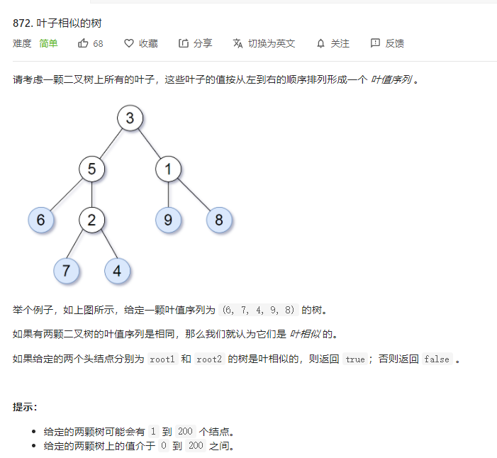

# 872.叶子相似的树
  

```
/**
 * Definition for a binary tree node.
 * function TreeNode(val, left, right) {
 *     this.val = (val===undefined ? 0 : val)
 *     this.left = (left===undefined ? null : left)
 *     this.right = (right===undefined ? null : right)
 * }
 */
/**
 * @param {TreeNode} root1
 * @param {TreeNode} root2
 * @return {boolean}
 */
var leafSimilar = function(root1, root2) {
    let temp = [];
    const mid = (r) => {
        if (r) {
            if (!r.left && !r.right) {
                temp.push(r.val);
            } else {
                mid(r.left);
                mid(r.right);
            }
        }
    }

    mid(root1);

    let one = temp.slice();
    temp = [];
    mid(root2);


    if (one.length !== temp.length) {
        return false;
    }

    console.log(one, temp)
    for(let i=0;i<temp.length;i++) {
        console.log(temp[i] !== one[i], temp[i], one[i])
        if (temp[i] !== one[i]) {
            return false;
        }
    }

    return true;
};
```