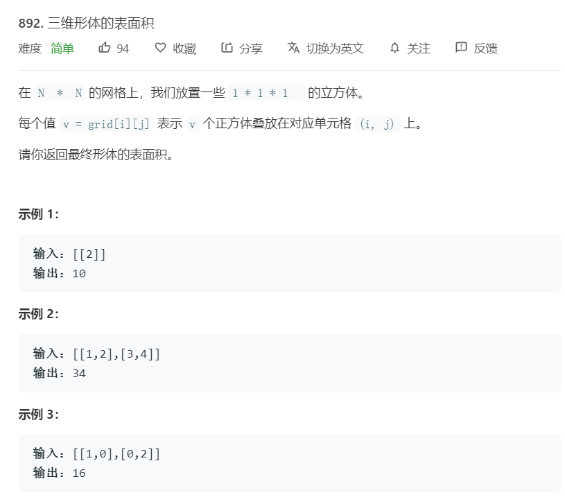
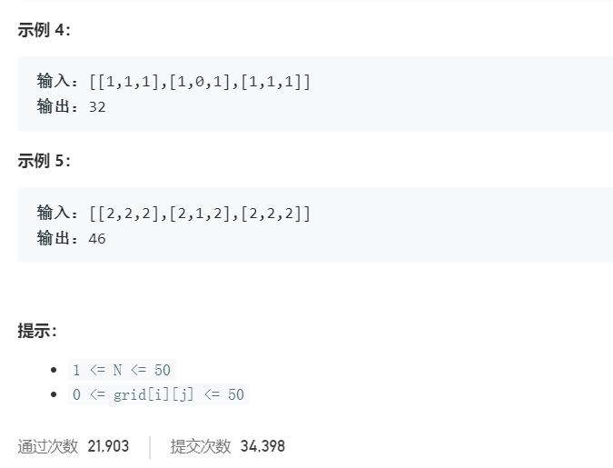

# 892.三维形体的表面积
  

  

```
/**
 * @param {number[][]} grid
 * @return {number}
 */
var surfaceArea = function(grid) {
    let m = grid.length,n = grid[0].length;
    if(m == 0){
        return 0;
    }

    let temp = 0,result = 0;

    for(let i=0;i<m;i++){
        for(let j=0;j<n;j++){
            temp += grid[i][j] > 1 ? grid[i][j] -1 : 0;
            if(i > 0){
                temp += Math.min(grid[i][j],grid[i-1][j]);
            }
            if(j > 0){
                temp += Math.min(grid[i][j-1],grid[i][j]);
            }
            result += grid[i][j];
        }
    }

    return result * 6 - temp*2;
};
```

```
class Solution {
    public int surfaceArea(int[][] grid) {
        if(grid == null || grid.length < 1 || grid[0].length < 1) return 0;
        //统计所有的立方体数量
        int blocks = 0;
        //统计有多少个面被其他面盖住，那么就在所有的立方体的表面积上减去被盖住的面数×2（因为盖住一个面需要另一个面来盖，所以会损失2个面）；
        int cover = 0;
        for(int i = 0;i < grid.length;++i) {
            for(int j = 0; j < grid[0].length;++j) {
                blocks += grid[i][j];
               //这个是统计当前格子中因为堆叠而盖住了几个面
                cover += grid[i][j] > 1 ? grid[i][j] -1 : 0;
                if(i > 0) {
                    //看看上一行同一列盖住了多少个面
                    cover += Math.min(grid[i-1][j],grid[i][j]);
                }
                if(j > 0) {
                    //看看同一行前一列盖住了几个面
                    cover += Math.min(grid[i][j-1],grid[i][j]);
                }
            }
        }
        return blocks * 6 - cover * 2;
    }
}
```