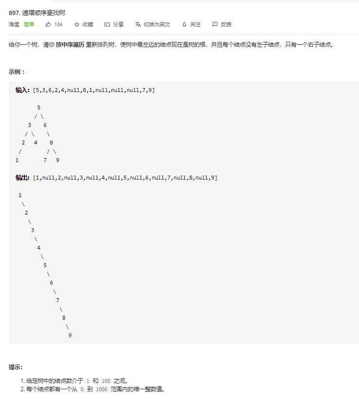

# 897.递增顺序查找树
  

```
/**
 * Definition for a binary tree node.
 * function TreeNode(val) {
 *     this.val = val;
 *     this.left = this.right = null;
 * }
 */
/**
 * @param {TreeNode} root
 * @return {TreeNode}
 */
var increasingBST = function(root) {
    let res = [];

    const mid = (r) => {
        if (r) {
            mid(r.left);
            res.push(r.val);
            mid(r.right);
        }
    }

    mid(root);
    let father = new TreeNode(res.shift());
    let one = father;

    while(res.length > 0) {
        father.right = new TreeNode(res.shift());
        father = father.right;
    }

    // console.log(one)

    return one;
};
```