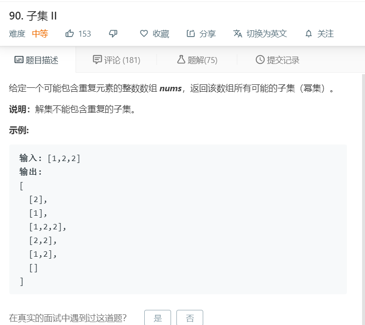

# 90.子集II
  

```
/**
 * @param {number[]} nums
 * @return {number[][]}
 */
var subsetsWithDup = function(nums) {
    let res = [[]];
    let start = 1;
    nums.sort((a,b)=>a-b)

    for(let i=0;i<nums.length;i++){
        let temp = [];
        for(let j=0,len = res.length;j<len;j++){
            if(i > 0 && j < start && nums[i]==nums[i-1]){
                continue;
            }
            temp.push(res[j].concat([nums[i]]));
        }

        start = res.length;
        res.push(...temp);
    }

    return res;
};
```