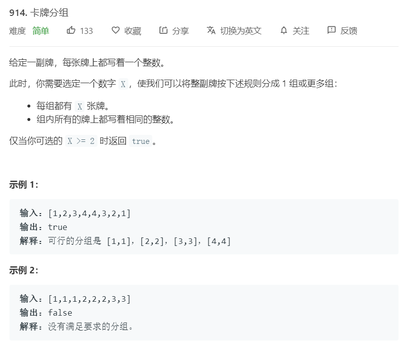
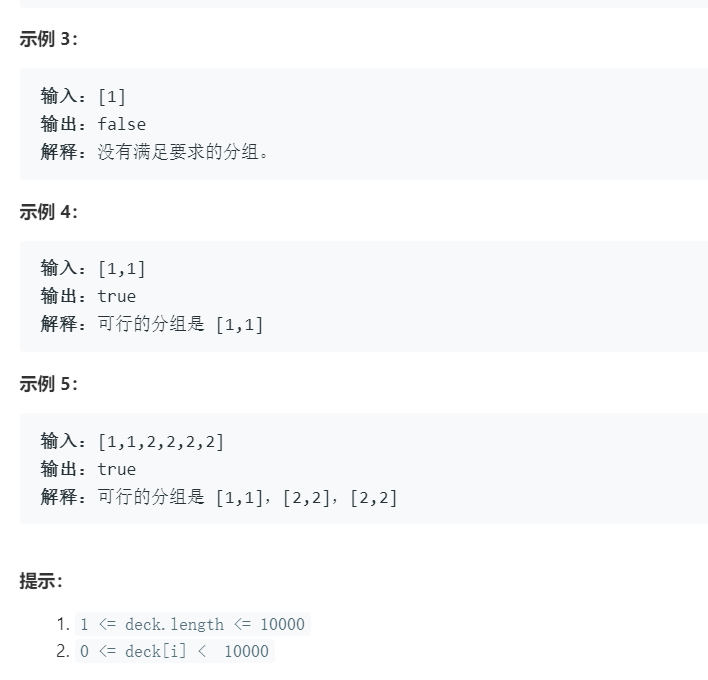

# 914.卡牌分组
   

  

```
/**
 * @param {number[]} deck
 * @return {boolean}
 */
var hasGroupsSizeX = function(deck) {
    deck.sort((a,b)=>a-b);

    // console.log(deck)
    let tempmin = [];

    for(let i=0;i<deck.length;i++){
        let temp = deck.lastIndexOf(deck[i]) - deck.indexOf(deck[i]);
        tempmin.push(temp+1);
        i += temp;
    }

    // console.log(tempmin);
    tempmin = [...new Set(tempmin)];
    console.log(tempmin);

    let one = (a,b) => {
        return b == 0 ? a : one(b,a % b);
    }

    let x = 0;

    for(let i=0;i<tempmin.length;i++){
        if(tempmin[i] > 0){
            x = one(x,tempmin[i]);
            if(x == 1){
                return false;
            }
        }
    }
    return x >= 2;
};
```